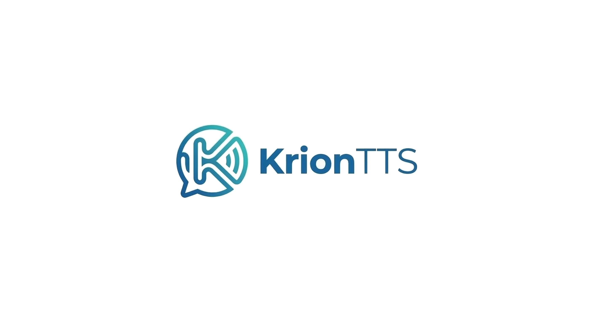

# KrionTTS

[](https://github.com/GeorgeSakketos/KrionTTS/releases/tag/alpha-2026-03-14)


> Offline Text-to-Speech for Android, powered by sherpa-onnx and built with Kotlin + Jetpack Compose.



## Why KrionTTS? 🚀

KrionTTS focuses on fast, private, on-device speech generation.
After a model is downloaded, synthesis runs locally with no cloud dependency.

## Highlights ✨

- 📴 Fully offline inference after model download
- 🧠 On-device TTS runtime via sherpa-onnx
- 🌍 Curated multi-language model catalog
- 👥 Speaker selection for multi-speaker models
- 📥 One installed model per language (managed automatically)
- 🔊 Generate and play speech in-app
- 💾 Export to WAV and MP3
- 📂 Save output directly to the Downloads folder

## Tech Stack 🛠️

- Kotlin + Coroutines
- Jetpack Compose (Material 3)
- Android SDK 35, min SDK 26
- sherpa-onnx Android AAR
- OkHttp (model downloads)
- Apache Commons Compress (tar.bz2 extraction)
- TAndroidLame (WAV -> MP3 conversion)

## Project Structure 📁

```text
app/src/main/java/com/krion/tts/
├── MainActivity.kt
├── domain/
│   ├── AudioExporter.kt
│   ├── LanguageModel.kt
│   ├── ModelCatalog.kt
│   ├── ModelRepository.kt
│   └── OfflineTtsManager.kt
└── ui/
    ├── KrionScreen.kt
    ├── KrionUiState.kt
    └── KrionViewModel.kt
```

## Getting Started ⚙️

### Prerequisites

- Android Studio (latest stable recommended)
- JDK 17
- Android SDK with API 35

### Run in Android Studio

1. Open the project.
2. Wait for Gradle sync to complete.
3. Select a device/emulator (Android 8.0+).
4. Run the app.

### Build from CLI

```bash
./gradlew :app:assembleDebug
./gradlew :app:assembleRelease
```

Generated APKs are placed under app/build/outputs/apk.

## Release Notes 📦

### Alpha Channel

The current alpha pre-release is published on GitHub Releases:

- Release page: https://github.com/GeorgeSakketos/KrionTTS/releases/tag/alpha-2026-03-14
- APK: https://github.com/GeorgeSakketos/KrionTTS/releases/download/alpha-2026-03-14/KrionTTS-alpha-2026-03-14.apk

Note: the alpha APK is intended for testing.

## Model & Runtime Notes 📚

- Catalog sources include open sherpa-onnx compatible model families (MMS, Piper, Coqui where available).
- Archive extraction handles non-canonical package layouts and normalizes required model files.
- Language installation policy keeps one active model per language.
- Speaker preferences are persisted per installed model.
- Internet permission is used for model downloads only.

## License

This repository currently does not define a license file.
If you plan to distribute or accept external contributions, adding a license is strongly recommended.
